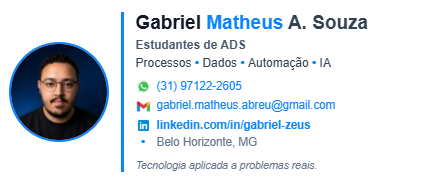
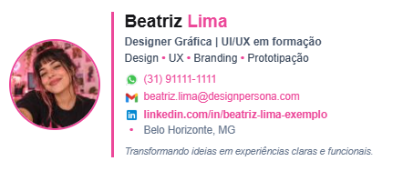
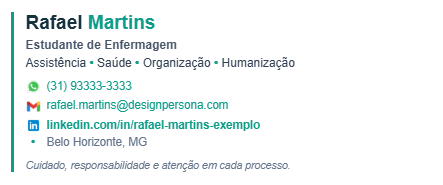

# Gerador de Assinatura Profissional

Gerador web de assinaturas profissionais para e-mail, com personalização visual, validação de dados e desenvolvimento assistido por IA generativa.

**Versão atual:** `v1.3.6`



## Sobre o projeto

O projeto nasceu de uma necessidade real: criar uma assinatura de e-mail profissional, alinhada à identidade visual do LinkedIn e adequada para candidaturas, contato com recrutadores, professores, empresas e networking.

A ideia evoluiu para uma ferramenta reutilizável, permitindo que outras pessoas preencham seus próprios dados, escolham cores, visualizem o resultado em tempo real e copiem a assinatura pronta para o Gmail sem editar HTML manualmente.

O desenvolvimento foi realizado com apoio do **ChatGPT da OpenAI**, utilizando **IA generativa e Prompt Engineering**. Minha atuação concentrou-se na definição do problema, levantamento e refinamento de requisitos, decisões de experiência do usuário, testes funcionais, identificação de bugs e evolução iterativa da solução.

> O código HTML, CSS e JavaScript foi produzido e refinado com assistência de IA. O projeto busca demonstrar como IA generativa pode ser aplicada de forma prática para transformar uma necessidade real em uma solução funcional.

## Funcionalidades

- preenchimento de nome, curso/profissão, áreas de atuação e localização;
- geração automática de link para WhatsApp (`wa.me`);
- link de e-mail (`mailto:`);
- link para perfil do LinkedIn;
- máscara visual de telefone no formato `(xx) xxxxx-xxxx`;
- validação de telefone e e-mail;
- seleção de cor principal e cor de destaque;
- opção de usar a cor de destaque ou preto nos hyperlinks;
- foto opcional carregada do computador;
- otimização automática da foto para reduzir o tamanho da assinatura;
- perfis fictícios de demonstração para diferentes áreas profissionais;
- placeholders em cinza para diferenciar exemplos de dados reais;
- pré-visualização em tempo real;
- cópia da assinatura formatada para o Gmail;
- geração, cópia e download do HTML da assinatura;
- painel avançado com visualização do código HTML;
- contador aproximado de caracteres em relação ao limite do Gmail;
- estrutura de contatos otimizada para leitura em telas menores.

## Exemplos de assinaturas

| Engenharia | Design | Saúde |
| --- | --- | --- |
|  |  |  |

As personas acima são fictícias e existem apenas para demonstrar diferentes combinações de profissão, áreas de interesse e identidade visual.

## Como usar

1. Abra o arquivo `index.html` no navegador.
2. Escolha um perfil de exemplo ou preencha seus próprios dados.
3. Personalize cores e informações da assinatura.
4. Se desejar, carregue uma foto do computador.
5. Confira o resultado na pré-visualização.
6. Clique em **Copiar assinatura formatada**.
7. No Gmail, acesse **Configurações → Ver todas as configurações → Geral → Assinatura**.
8. Crie uma nova assinatura e cole o conteúdo.

## Estrutura do repositório

```text
gerador-assinatura-profissional/
├── index.html
├── README.md
├── CHANGELOG.md
├── LICENSE
├── .gitignore
└── assets/
    └── screenshots/
        ├── assinatura-gabriel.png
        ├── persona-beatriz.png
        ├── persona-lucas.png
        └── persona-rafael.png
```

## Tecnologias e abordagem

- HTML
- CSS
- JavaScript
- Canvas API para otimização local de imagens
- IA generativa
- Prompt Engineering
- ChatGPT / OpenAI

O processo envolveu definição de requisitos, testes, análise de comportamento, correção de erros e refinamento da interface em ciclos sucessivos.

## Versionamento

O projeto utiliza uma lógica inspirada em **Semantic Versioning** (`MAJOR.MINOR.PATCH`):

- `MAJOR`: mudanças grandes ou incompatíveis;
- `MINOR`: novas funcionalidades compatíveis com a versão anterior;
- `PATCH`: correções de bugs e pequenos refinamentos.

Exemplo: em `v1.3.6`, `1` representa a geração principal do projeto, `3` o conjunto atual de funcionalidades e `6` a sexta revisão/correção dentro dessa linha.

O histórico detalhado está em [`CHANGELOG.md`](CHANGELOG.md).

## Evolução resumida

- `v1.0.0` — primeira versão funcional;
- `v1.1.0` — perfis fictícios de demonstração;
- `v1.2.0` — painel HTML movido para opções avançadas;
- `v1.3.0` — validações, máscara de telefone, placeholders e personalização de links;
- `v1.3.1` a `v1.3.6` — correções, melhorias de foto, compatibilidade com Gmail e refinamentos para mobile.

## Aprendizados

Este projeto me permitiu praticar principalmente:

- transformar uma necessidade real em requisitos funcionais;
- estruturar prompts mais específicos para desenvolvimento assistido por IA;
- testar e validar funcionalidades;
- identificar bugs e descrever problemas de forma objetiva;
- iterar sobre interface e experiência do usuário;
- compreender melhor a relação entre HTML, CSS, JavaScript e comportamento de uma aplicação web;
- documentar a evolução de um projeto;
- validar a solução em um cenário real de uso no Gmail e em dispositivo móvel.

## Próximos passos possíveis

- novos modelos visuais de assinatura;
- opção de salvar configurações localmente;
- melhorias de acessibilidade;
- testes em mais clientes de e-mail;
- publicação online com GitHub Pages.

## Autor

**Gabriel Matheus Abreu de Souza**

- LinkedIn: [linkedin.com/in/gabriel-zeus](https://www.linkedin.com/in/gabriel-zeus/)
- GitHub: [github.com/gabrielmasouza](https://github.com/gabrielmasouza)

## Licença

Este projeto está disponibilizado sob a licença MIT. Consulte o arquivo [`LICENSE`](LICENSE) para mais informações.
